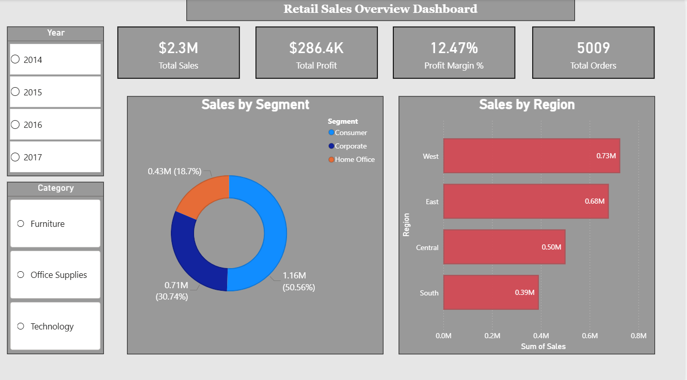

# Retail Sales & Profitability Analysis

## Project Overview

This end-to-end Data Analytics project analyzes retail sales data from a US-based superstore between 2014 and 2017. The objective was to identify profitable regions, customer segments, and product categories while uncovering loss-making areas that require business attention.

The project was completed using Excel, MySQL, Power BI, and Tableau, following a complete analytics workflow from data cleaning to dashboard creation and business insight generation.

---

## Problem Statement

You are a Data Analyst at a retail company. Management wants to know which regions, product categories, and customer segments are driving profit — and which are causing losses. The goal is to analyze 4 years of sales data and present actionable business insights.

### Business Questions

1. What are the total sales, total profit, and overall profit margin?
2. Which region generates the highest sales and profit?
3. Which product category and sub-category are the most and least profitable?
4. Which customer segment contributes the most revenue?
5. How have sales trended over time?
6. Which sub-categories are operating at a loss?

---

## Tools Used

- Microsoft Excel
- MySQL
- Power BI
- Tableau Public

---

## Dataset

**Source:** Superstore Dataset

Kaggle Link:

https://www.kaggle.com/datasets/vivek468/superstore-dataset-final

Dataset contains approximately 10,000 retail sales records including:

- Orders
- Sales
- Profit
- Discount
- Customer Segment
- Region
- Category
- Sub-Category
- Shipping Information

---

## Project Workflow

### Excel

- Data cleaning and validation
- Blank value checks
- Duplicate removal
- Delivery Days calculation
- Pivot Tables
- Slicers
- Conditional Formatting
- Summary Metrics

### MySQL

- Data import and validation
- Aggregate analysis
- Region-wise sales and profit analysis
- Customer segment analysis
- Yearly trend analysis
- Profitability analysis using GROUP BY, HAVING, ORDER BY, DATEDIFF, and Aggregate Functions

### Power BI

Created a 3-page interactive dashboard:

#### Page 1 — Overview

- Total Sales KPI
- Total Profit KPI
- Profit Margin KPI
- Total Orders KPI
- Sales by Region
- Sales by Segment

#### Page 2 — Product Performance

- Profit by Sub-Category
- Product Performance Table
- Conditional Formatting for Loss-Making Products

#### Page 3 — Sales Trend

- Monthly Sales Trend
- Region Filter
- Interactive Trend Analysis

### Tableau

Built an executive dashboard containing:

- Profit by Sub-Category
- Monthly Sales Trend
- Sales by Region & Segment
- Interactive Region Filter

---

## Key Findings

- West region generated the highest overall sales.
- Central region had the lowest profit margin.
- Technology category delivered the strongest profit performance.
- Furniture category generated the weakest profit margin.
- Tables and Bookcases operated at a net loss due to heavy discounting.
- Consumer segment contributed approximately 50% of total revenue.
- Sales increased consistently from 2014 to 2017.
- High discounts (above 40%) frequently resulted in negative profit.

---

## Power BI Dashboard Screenshots

### Overview Dashboard




---

### Product Performance Dashboard


---

### Sales Trend Dashboard


---

## Tableau Public Dashboard

View Interactive Dashboard:

https://public.tableau.com/app/profile/ashish.singh5245/viz/RetailSalesDashboard_17809156318030

---

## GitHub Repository

Repository Link:

https://github.com/ashishhhsingh/retail-sales-analysis

---

## Repository Structure

```text
retail-sales-analysis/
│
├── README.md
│
├── data/
│   └── superstore_raw.csv
│
├── excel/
│   └── superstore_excel.xlsx
│
├── sql/
│   └── superstore_queries.sql
│
├── powerbi/
│   └── superstore_dashboard.pbix
│
├── screenshots/
│   ├── overview.png
│   ├── product performance.png
│   └── sales trend.png
│
└── tableau/
    └── superstore_story.twbx
```

---

## Resume Highlights

- Analyzed 9,994 retail sales records across 4 years to identify business growth opportunities and loss-making areas.
- Performed data cleaning and transformation using Excel and Power Query.
- Wrote SQL queries using GROUP BY, HAVING, ORDER BY, DATEDIFF, and aggregate functions to answer key business questions.
- Developed a 3-page interactive Power BI dashboard with KPI tracking and dynamic filtering.
- Designed an executive-level Tableau dashboard and published it on Tableau Public.
- Identified that Tables and Bookcases were consistently loss-making due to excessive discounting.

---

## Author

**Ashish Singh**

GitHub: https://github.com/ashishhhsingh

Tableau Public: https://public.tableau.com/app/profile/ashish.singh5245
